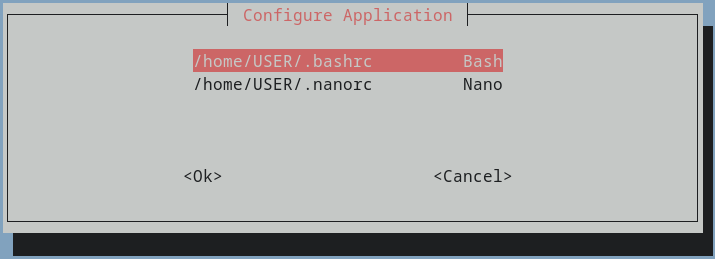
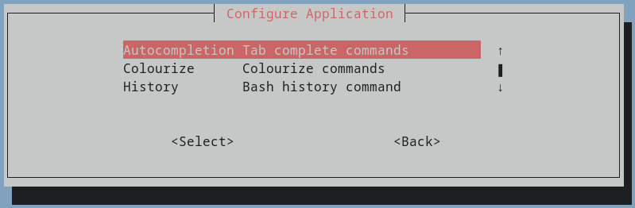
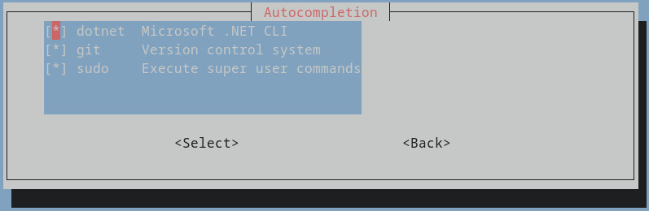

# Configspack

Configspack is a post-installation script for UNIX-like systems and is written purely with Bash. It's a terminal user interface application, highly customizable and allows for quickly generating new or editing existing dotfiles.

**Disclaimer:** This project is still in development and all features are a subject of change for improvement.

## Table of Content
- [Getting Started](#getting-started)
- [Customizations](#customizations)

## Getting Started
Before anything, change the file paths of the default configurations.
```sh
cd path/to/configspack
```
Use your favourite text editor to open *bashrc.templates.txt*. Change the value of "dotfile" to your home directory. Do the same with *nanorc.templates.txt*.

Enter the following code in the terminal to get started:
```sh
bash wizard.sh
```

Choose the dotfile to configure:



Then, select the category to configure:



Finally, check the boxes for each setting to include:



## Customizations
### ***Setup configs.json***
Configure a new dotfile with a configs.json file. In the project directory,
```sh
cd configs
touch dotfilename.configs.json
```

Below is the file structure:

```json
{
    "app": "", // Application name
    "dotfile": "", // Exact filepath to the dotfile location
    "description": "", // Description for the application. Used in the main menu display
    "categories": {  // Organize settings in categories
        "category_0": {  // Category name. Pick a name of your liking
            "menuDescription": "",  // Displayed as description in the TUI
            "subcatgory_0": {  // Subcatgory name. Pick a name of your liking
                "description": "",  // Displayed as description in the TUI
                "snippet": "",  // Code snippet inserted in the final dotfile. Accepts escape characters like \n
                "checkbox": "ON" // Used internally to keep track of enabled and disabled settings
            }
        }
    }
}
```

A better and convinient interface to configure the settings is in development

### ***Templates***
Configspack allows using templates to generate dotfiles with. Anything in these files will always be included in their corresponding dotfile.

From the project directory,
```sh
cd templates
touch dotfilename.templates.txt
```

